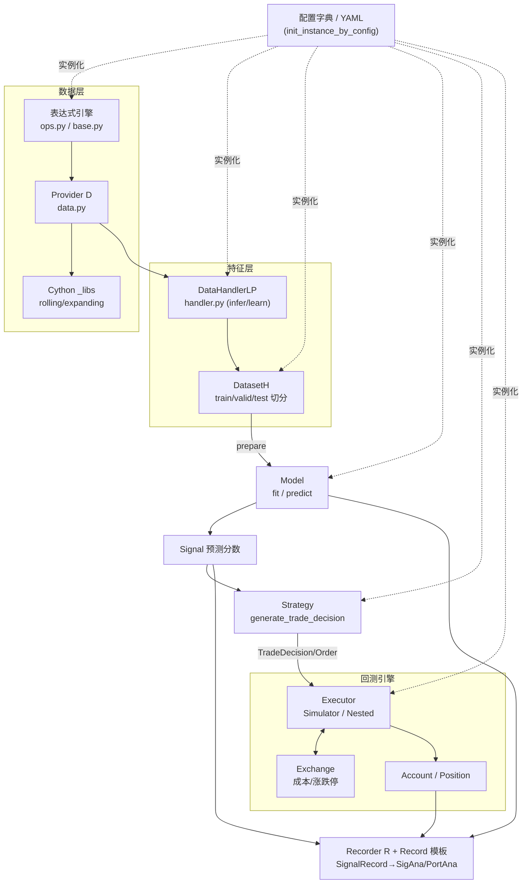
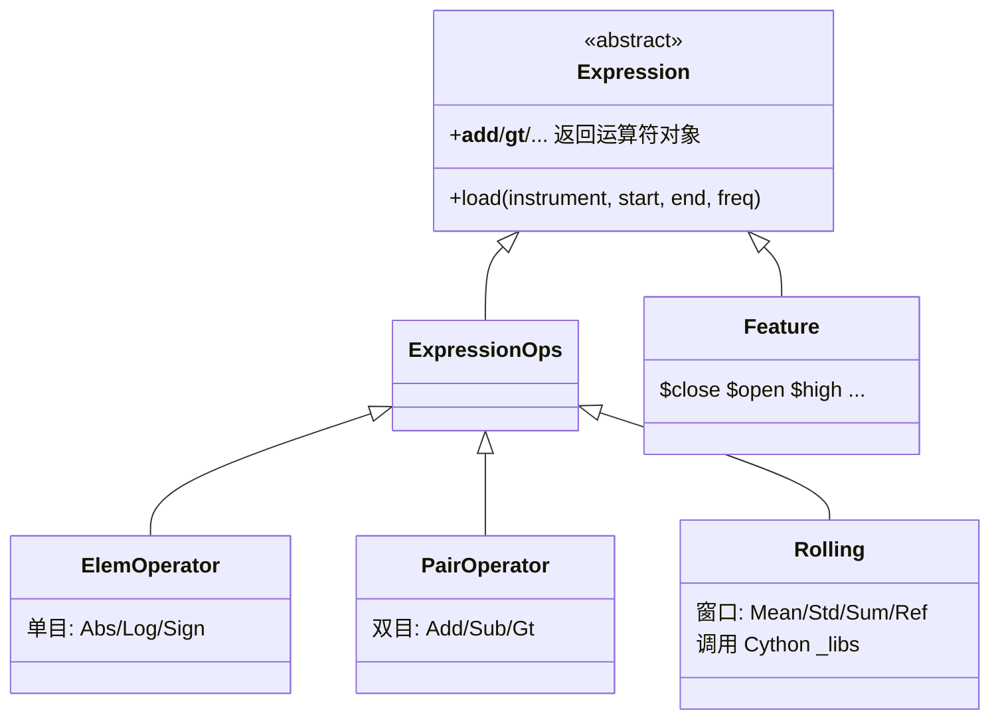
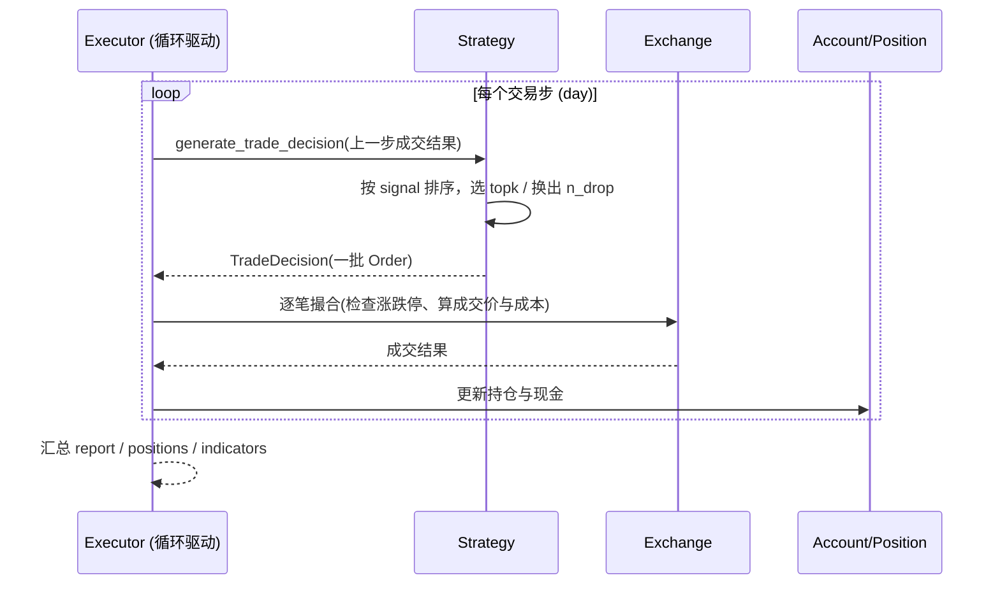
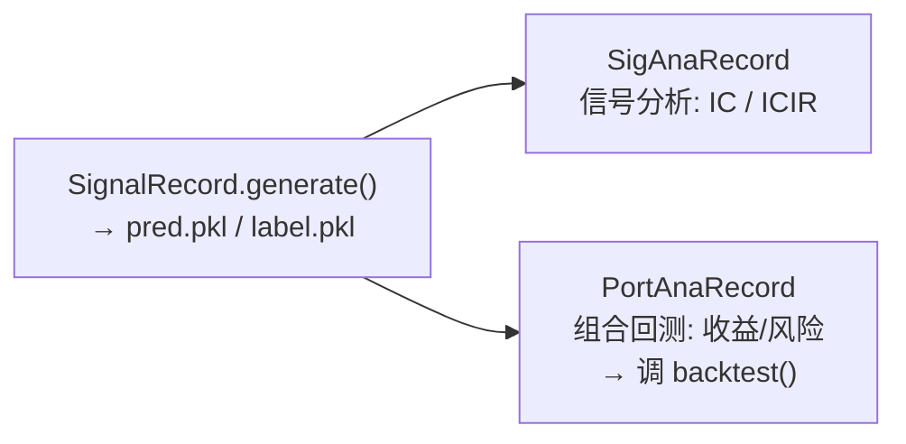

# Qlib 源码学习指南

> **读者**：懂 Python 与机器学习、初次接触 Qlib 这个项目的资深工程师。
> **目标**：不只是知道 Qlib「能做什么」，而是理解它「为什么这样设计」以及「各部分如何咬合」。
> **与 `study/*.html` 的关系**：那套 HTML 是面向入门的分章教程；本指南是面向源码理解的地图 —— 直击设计决策、贯通式数据流、带推理的代码样例，以及可独立完成的探索任务。

---

## 0. 如何使用这份指南

每一节遵循同一节奏：**先讲存在的理由（Why），再讲机制（How），最后给一个你能独立做的探索任务**。

- 📌 **门槛概念（Threshold Concepts）**：第 2 节的三个概念一旦想通，后面所有东西都会「咔哒」一下对上。请务必先啃透它们。
- 🔍 **精思提问（Elaborative Interrogation）**：每节都有一个「为什么不……？」的问题。别跳过 —— 它逼你思考设计权衡，这正是形成专家心智模型的机制。
- 🧪 **探索任务（PRIMM）**：遵循 Predict → Run → Investigate → Modify。先预测再验证，比直接读代码的留存率高得多。

如果你时间有限：读完第 1、2 节就已经能看懂整个仓库的骨架；再读第 3 节能看懂一次回测；全部读完则能改造任意子系统。

---

## 1. 它解决什么问题（Purpose Before Structure）

想象你是一个量化研究员。你的日常循环是：

1. 想到一个「因子」假设（比如「过去 5 日均价上穿 20 日均价的股票会涨」）；
2. 把它算成每支股票每天的一个数值；
3. 用历史数据训练一个模型，从一堆因子预测未来收益；
4. 根据模型打分构造持仓（买分高的、卖分低的）；
5. 在历史行情上模拟交易，扣掉手续费/滑点，看到底赚不赚钱；
6. 记录这次实验的所有参数与结果，好和下一次对比。

这个循环里每一步都有大量重复的、易错的工程苦活：数据对齐、避免「未来函数」、特征工程、切分训练/测试集不泄露、成本建模、指标计算、实验追踪……

**Qlib 的本质是把这个循环的每一步抽象成可替换的组件，并用统一的配置机制把它们串起来。** 你只改「假设」（因子/模型/策略），基础设施不用重写。

```
研究员的循环                     Qlib 的组件
────────────────────────────────────────────────
① 因子假设            ←→   表达式引擎 (qlib/data/ops.py)
② 算成数值            ←→   数据层 Provider (qlib/data/data.py)
③ 训练模型            ←→   Dataset/Handler + Model (qlib/data/dataset, qlib/model)
④ 构造持仓            ←→   Strategy (qlib/strategy, qlib/contrib/strategy)
⑤ 模拟交易           ←→   Backtest: Exchange + Executor (qlib/backtest)
⑥ 记录实验           ←→   Workflow: Recorder R + Record 模板 (qlib/workflow)
```

> 🔍 **精思提问**：为什么 Qlib 要自己造一套「表达式引擎」来算因子，而不是让用户直接写 pandas？
> （提示：想想「同一个 `Mean($close,5)` 在训练时算一次、回测时又要算、上线时还要算」——一致性、缓存复用、避免未来函数、以及跨 1 万支股票的性能。答案在第 3 节。）

🧪 **探索任务（入门）**：打开 `examples/workflow_by_code.py`，只读不运行。数一数它用了上面 6 个组件中的哪几个，各对应哪几行。这份 90 行的脚本就是整个循环的最小实现，后面每一节都在拆解它。

---

## 2. 三个门槛概念（读懂这三点，全局豁然开朗）

### 门槛概念 A：一切皆「配置字典 → 对象」

Qlib 里几乎每个组件（模型、数据集、处理器、策略、执行器）都不是直接 `new` 出来的，而是先写成一个字典：

```python
{
  "class": "LGBModel",
  "module_path": "qlib.contrib.model.gbdt",
  "kwargs": {"learning_rate": 0.05, "num_leaves": 210}
}
```

然后交给一个函数变成真正的对象。这个函数是**整个框架的粘合剂**：`init_instance_by_config`（`qlib/utils/mod.py:122`）。

```python
def init_instance_by_config(config, default_module=None, accept_types=(), try_kwargs={}, **kwargs):
    if isinstance(config, accept_types):   # 已经是对象了？直接返回        (mod.py:156)
        return config
    if isinstance(config, (str, Path)):    # 是 "file://.../x.pkl"？反序列化 (mod.py:159)
        ...                                # 用 RestrictedUnpickler 安全加载
    klass, cls_kwargs = get_callable_kwargs(config, default_module)  # 解析类   (mod.py:176)
    return klass(**cls_kwargs, **kwargs)                             # 实例化   (mod.py:179)
```

`get_callable_kwargs` 用 `module_path` + `class` 通过 `importlib` 找到类对象，再把 `kwargs` 展开传进构造函数。

**为什么这很重要（transformative）**：
- 一份 YAML 配置和一段 Python 代码是**等价**的 —— `qrun config.yaml` 和手写脚本做的是同一件事。
- 想接入你自己的模型？只要它可被 `module_path.class` import 且构造参数是 kwargs，框架其余部分**一行都不用改**。
- 组件之间只通过「配置 + 约定的接口」耦合，所以能自由替换。

> 🔍 **精思提问**：`init_instance_by_config` 里为什么要有 `accept_types`（如果已经是对象就原样返回）这一分支？
> （提示：配置可以嵌套 —— DatasetH 的 config 里嵌着 handler 的 config。但有时你在代码里已经手动造好了 handler 对象想直接塞进去。这个分支让「配置」和「现成对象」可以混用。）

### 门槛概念 B：表达式是「惰性的树」，不是「立即算的值」

当你写 `Mean($close, 5)`，Qlib **不会立刻计算**。它构造一棵**运算符对象树**：`Mean` 节点，孩子是 `Feature("close")` 和常数 `5`。真正的计算发生在有人调用树根的 `.load(instrument, start, end, freq)` 时，自底向上递归求值。

秘密在 `Expression` 基类重载了所有 Python 运算符（`qlib/data/base.py:32-140`）：

```python
class Expression(abc.ABC):
    def __add__(self, other):
        from .ops import Add
        return Add(self, other)        # $close + $open  →  Add(Feature(close), Feature(open))
    def __gt__(self, other):
        from .ops import Gt
        return Gt(self, other)         # $high > $close  →  Gt(...)
    # ... __sub__/__mul__/__truediv__/__and__/__or__ 等等全都返回一个运算符对象
```

所以 `$close / Ref($close, 1) - 1`（日收益率）在 Python 里求值的结果**不是数字，而是一棵表达式树**。

**为什么这很重要（integrative）**：这一个设计同时解释了后面很多事 ——
- 因子字符串能被解析、缓存、跨股票批量计算；
- 同一因子在训练/回测/上线里都是同一棵树，保证一致；
- `Rolling` 类算子（`Mean/Std/Sum`…）把窗口计算下推到 **Cython 扩展** `qlib/data/_libs/rolling.pyx` 加速，这就是为什么第 2 章强调必须先编译 `.so`。

### 门槛概念 C：`infer` 与 `learn` 是两条数据管线，为了防泄露

新手最容易栽的坑：把测试集的统计量用到了训练里（数据泄露），或者把「丢掉无标签样本」这种操作用到了预测阶段（预测时哪有标签）。

Qlib 在 `DataHandlerLP`（LP = Learn/Process，`qlib/data/dataset/handler.py:382`）里用**三个数据 key** 把这件事制度化：

| Key | 属性 | 含义 |
|-----|------|------|
| `DK_R` = "raw" | `_data` | DataLoader 加载的原始数据 |
| `DK_I` = "infer" | `_infer` | 用于**推理/预测**的处理结果 |
| `DK_L` = "learn" | `_learn` | 用于**训练模型**的处理结果 |

- 放进 `infer_processors` 的处理器必须是「推理安全」的（如标准化）；像 `DropnaLabel`（丢掉没标签的行）声明 `is_for_infer() == False`（`processor.py:109`），一旦误放进 infer 管线会直接报错。
- 标准化这类需要「拟合」的处理器（`ZScoreNorm` 等）**只在训练集上 fit**，再套用到测试集 —— 这由 `fit_start_time/fit_end_time` 注入完成，从机制上杜绝了用未来数据拟合。

> 🔍 **精思提问**：为什么不干脆一条管线处理完，训练和推理共用？
> （提示：想想 label 归一化 —— 训练时你想对 label 做变换以稳定学习，但推理时你根本没有真实 label，也不该假装有。两条管线让「只在训练时该做的事」无法泄漏到推理。）

🧪 **探索任务（PRIMM，核心）**：
1. **Predict**：`Mean($close, 5) + $open` 求值后是什么 Python 类型？
2. **Run**：`python -c "import qlib; qlib.init(); from qlib.data.ops import Mean; from qlib.data.base import Feature; print(type(Mean(Feature('close'),5) + Feature('open')))"`
3. **Investigate**：打开 `qlib/data/base.py:62`，看 `__add__` 返回什么。
4. **Modify**：在 `qlib/data/ops.py` 里找到 `Mean` 类（约 `:827`），看它的父类 `Rolling`（`:713`）如何调用 Cython。

---

## 3. 系统地图（Concept Map）

在深入任何单个子系统前，先建立全局连接图。下面是控制/数据流向：



**读图要点**：`CFG` 用虚线指向几乎所有组件 —— 这就是门槛概念 A：配置是万物的起点。实线是运行时的数据流：数据层算出因子 → Handler 处理成 infer/learn 两份 → Dataset 切分 → Model 训练/预测出 Signal → Strategy 转成订单 → Executor 在 Exchange 里成交、更新 Account → Recorder 全程记录。

🧪 **探索任务**：对着这张图，回到 `examples/workflow_by_code.py`，用笔在每行代码旁标出它对应图中哪个节点。你会发现 `R.start()` 之前是「搭数据和模型」，`R.start()` 之内是「训练→记录→分析」。

---

## 4. 数据层：从因子字符串到一列数值

**存在的理由**：量化研究的第一个瓶颈是「同一个因子要被反复、跨海量标的、在不同阶段一致地计算」。数据层就是为此而生的**惰性、可缓存、可加速的计算图**。

### 4.1 三个角色



- **`Feature`**：叶子节点，对应磁盘上的一列原始行情（`$close` → close 列）。
- **`ElemOperator` / `PairOperator`**：单目/双目算子（`ops.py:37` / `:231`）。
- **`Rolling`**：窗口算子基类（`ops.py:713`），`Ref/Mean/Sum/Std/Max/Min/Corr` 等都继承它，把重活下推给 Cython（`_libs/rolling.pyx`）。

### 4.2 一次 `.load()` 里发生了什么

`Expression.load(instrument, start_index, end_index, *args)`（`base.py:142`）的职责被有意分成两半（见其 docstring）：
1. **共享部分**（在 `Expression` 里）：查缓存、处理边界与错误；
2. **各算子特有部分**（在每个子类的 `_load_internal`）：真正的计算。

`Feature` 的 `_load_internal` 会去调全局的 `FeatureD.feature(...)` 拿原始列；`Rolling` 的则先递归 load 孩子，再对结果套窗口函数。这就是「自底向上求值一棵树」。

> 🔍 **精思提问**：为什么把 load 拆成「共享缓存逻辑 + 子类计算逻辑」两层，而不是每个算子各写各的缓存？
> （提示：DRY + 一致性。缓存 key、错误处理、边界裁剪对所有算子都一样，只有「怎么算」不同。这是模板方法模式 Template Method Pattern。）

### 4.3 Provider 与 `D`：数据从哪来

模块级的 `D`、`Cal`、`Inst`、`FeatureD`、`ExpressionD` 等（`data.py:1283-1289`）是 **`Wrapper` 占位对象**，在 `qlib.init()` 时才被真正的 Provider 实例填充（`register_all_wrappers`，`data.py:1291`）。默认全是本地实现：`LocalFeatureProvider`、`LocalExpressionProvider`…（配置见 `config.py:135`）。这解释了两件事：
- 为什么必须先 `qlib.init()` 才能用 `D.features(...)`；
- 为什么 `client`/`server` 两种模式能换出不同 Provider（server 启用磁盘缓存 + Redis，`config.py:250`）。

```python
import qlib
from qlib.data import D
qlib.init(provider_uri="~/.qlib/qlib_data/cn_data", region="cn")

# 因子字符串在这里被解析成表达式树并求值
df = D.features(
    ["SH600000"],
    ["$close", "Ref($close, 1)", "Mean($close, 5)", "$close / Ref($close, 1) - 1"],
    start_time="2020-01-01", end_time="2020-01-10",
)
print(df.head())   # 多级列索引：每个因子一列
```

### 4.4 PIT：为什么财务数据要「点」着看

行情数据每天一个值、不会被修正。但**财务数据会被追溯修正** —— 2014Q4 的净利润可能在 2015-03 首次披露、2015-06 又被修正。如果你回测时用了「最终修正版」，就等于用了未来才知道的信息（look-ahead bias，未来函数）。

`Expression` 的 docstring（`base.py:23`）明确区分了 **observation time（观测时刻）** 与 **period time（报告期）**。PIT 数据层（`qlib/data/pit.py`、`LocalPITProvider`）保证「在回测的某一天，你只能看到那一天之前**已经披露**的版本」。

> 🔍 **精思提问**：未来函数为什么是量化里最隐蔽、最致命的 bug？
> （提示：它不会报错、回测曲线还特别漂亮，只有真金白银上线后才暴露。所以框架层面用 PIT 把它堵死，比靠人自觉可靠得多。）

🧪 **探索任务（PRIMM）**：
1. **Predict**：`D.features(["SH600000"], ["Mean($close, 5)"], ...)` 返回的 DataFrame，前 4 行的均线值会是什么？（提示：窗口不满）
2. **Run**：跑上面的代码（需先下好数据）。
3. **Investigate**：验证前几行是否为 NaN，回到 `ops.py` 的 `Rolling`/`Mean` 看窗口不足时的行为。
4. **Modify**：把 `Mean($close, 5)` 改成 `($close - Mean($close, 5)) / Std($close, 5)`（5 日 z-score），观察列如何变化。你刚刚手写了一个因子。

---

## 5. 特征层：Handler 与 Dataset

**存在的理由**：模型要的是「干净、对齐、切分好、不泄露」的张量。数据层给的是「一列列因子」。中间这道厨房就是 Handler（处理）+ Dataset（切分）。

### 5.1 类层次与三条处理链

`DataHandlerABC → DataHandler → DataHandlerLP`（`handler.py:25 / 67 / 382`）。`DataHandlerLP` 持有三组处理器（都在 `__init__` 里由 `init_instance_by_config` 造出，`handler.py:496`）：

- `shared_processors`：最先跑，infer/learn 共享；
- `infer_processors`：只对推理管线；
- `learn_processors`：只对训练管线。

`process_type` 决定两条管线怎么接（`handler.py:445`）：

```
PTYPE_I (independent)          PTYPE_A (append，默认)
  shared                         shared
   ├── infer_processors           └── infer_processors
   └── learn_processors                └── learn_processors   ← learn 接在 infer 下游
```

`process_data(with_fit)`（`handler.py:552`）就是按上图构建 `_infer` 和 `_learn` 两个 DataFrame，`_run_proc_l`（`:529`）负责「按需 fit → transform」并用 `check_for_infer` 拦截推理不安全的处理器。

### 5.2 三种初始化时机（何时 fit）

`setup_data(init_type=...)`（`handler.py:633`）：

| init_type | 行为 | fit 发生在哪 |
|-----------|------|--------------|
| `IT_FIT_SEQ`（默认） | `process_data(with_fit=True)` | 每个处理器在**前一个处理器的输出**上 fit（顺序） |
| `IT_FIT_IND` | 先 `fit()` 再 `process_data()` | 每个处理器都在**原始 raw 数据**上独立 fit |
| `IT_LS`（load_state） | 只 `process_data()` | 不 fit（状态已从 pickle 恢复，用于上线） |

`IT_LS` 是「训练好的 handler 存盘 → 上线时直接复用拟合好的标准化参数」的关键，避免上线时用当日数据重新拟合造成漂移。

### 5.3 Alpha158 vs Alpha360

现成因子集在 `qlib/contrib/data/handler.py`：
- **Alpha158**（约 158 个）：人工特征工程 —— K 线形态 + 价量 + 大量 rolling 统计量。信息密度高，喂**树模型（LightGBM）**。
- **Alpha360**：过去 60 天 × 6 个价量字段 = 360 个原始滑窗特征。近乎原始行情，让**深度模型**自己提特征。

### 5.4 DatasetH：切分与 `prepare`

`DatasetH` 把一个 handler 和时间段 `segments`（train/valid/test）组合。模型通过 `dataset.prepare(...)` 取数据，签名与 `model/base.py` 文档里的用法一致：

```python
df_train, df_valid = dataset.prepare(
    ["train", "valid"],
    col_set=["feature", "label"],
    data_key=DataHandlerLP.DK_L,   # 训练 → 取 learn 管线的数据
)
x_train, y_train = df_train["feature"], df_train["label"]
```

注意 `data_key=DK_L`（训练）对 `DK_I`（预测）—— 这正是门槛概念 C 在 API 上的体现。

> 🔍 **精思提问**：为什么 `prepare` 要同时接受 `segment`（时间切分）和 `data_key`（infer/learn），而不是把它们合成一个参数？
> （提示：两者正交。你可能想取「test 段的 learn 版本」来算训练指标，也可能取「train 段的 infer 版本」来 debug。二维索引比一维枚举灵活。）

🧪 **探索任务**：读 `examples/benchmarks/LightGBM/workflow_config_lightgbm_Alpha158.yaml` 的 `data_handler_config` 段，找出它把哪些处理器放进了 `infer_processors` vs `learn_processors`，并解释每个为什么放那边。

---

## 6. 模型：一份两方法的契约

**存在的理由**：Qlib 要能容纳从 LightGBM 到 Transformer 的一切模型，还要能被配置系统实例化、被 Recorder 序列化。做法是把「模型」收敛成一个极简契约。

### 6.1 抽象基类

`qlib/model/base.py`：

```python
class BaseModel(Serializable, metaclass=abc.ABCMeta):
    @abc.abstractmethod
    def predict(self, *args, **kwargs) -> object: ...
    def __call__(self, *args, **kwargs):      # 语法糖：model(dataset) == model.predict(dataset)
        return self.predict(*args, **kwargs)

class Model(BaseModel):                        # 可学习模型
    def fit(self, dataset: Dataset, reweighter: Reweighter): ...
    @abc.abstractmethod
    def predict(self, dataset, segment="test") -> object: ...

class ModelFT(Model):                          # 可微调
    @abc.abstractmethod
    def finetune(self, dataset): ...
```

契约就两点：`fit(dataset)` 学习，`predict(dataset, segment)` 出分。注意 `predict` 收的是 **Dataset 对象**，不是裸张量 —— 模型自己调 `dataset.prepare(...)` 取数（第 5.4 节），从而由模型决定要 infer 还是 learn 版本。

> ⚠️ **易踩坑**：`base.py:29` 的 docstring 明确要求「学到的属性名不能以 `_` 开头」，否则序列化（存 params.pkl）时会丢。写自定义模型时切记。

### 6.2 一个真实模型如何工作

以 `qlib/contrib/model/gbdt.py` 的 `LGBModel` 为例，`fit` 的骨架就是：

```python
def fit(self, dataset, ...):
    df_train, df_valid = dataset.prepare(["train", "valid"], col_set=["feature", "label"],
                                         data_key=DataHandlerLP.DK_L)   # ← 取 learn 版本
    x_train, y_train = df_train["feature"], df_train["label"]
    # ... 构造 lgb.Dataset，self.model = lgb.train(...)  ← 属性不带下划线，可序列化
```

### 6.3 接入你自己的模型

放到 `qlib/contrib/model/` 下（约定俗成），遵守契约即可：

```python
from qlib.model.base import Model
class MyModel(Model):
    def __init__(self, alpha=0.5):     # kwargs 会由 init_instance_by_config 传入
        self.alpha = alpha             # 不带下划线
    def fit(self, dataset, reweighter=None):
        df = dataset.prepare("train", col_set=["feature", "label"], data_key="learn")
        # ... 训练，结果存 self.coef_ 之类（不带前导下划线）
    def predict(self, dataset, segment="test"):
        df = dataset.prepare(segment, col_set="feature", data_key="infer")  # ← 预测取 infer
        return ...  # 返回 pd.Series，index 是 (datetime, instrument)
```

配置里写 `{"class": "MyModel", "module_path": "qlib.contrib.model.my", "kwargs": {"alpha": 0.7}}` 就能被整条流水线使用。

> 🔍 **精思提问**：为什么 `predict` 返回的必须是带 `(datetime, instrument)` 多级索引的 `pd.Series`，而不是一个 numpy 数组？
> （提示：下游的 Strategy 要按「某天、某支股票」取分数来排序选股。索引携带了对齐信息，裸数组会丢失它。）

🧪 **探索任务**：在 `examples/benchmarks/` 里挑两个模型目录（如 `LightGBM` 和 `GRU`），对比它们的 `workflow_config_*.yaml`。找出：哪些配置段完全相同（数据/回测），哪些不同（model 段）。这直观展示了「组件可替换」。

---

## 7. 回测引擎：信号如何变成盈亏

**存在的理由**：一个模型分数不等于钱。你得决定买谁、卖谁、按什么价成交、扣多少费、遇到涨跌停怎么办。回测引擎把这些真实约束建模出来。

### 7.1 四个角色与一次调用

`backtest()`（`qlib/backtest/__init__.py:217`）是入口，内部先 `get_strategy_executor`（`:177`）把四件东西装配好：

```python
trade_account  = create_account_instance(...)          # 账户/持仓状态
trade_exchange = get_exchange(**exchange_kwargs)        # 成交/成本/涨跌停规则
common_infra   = CommonInfrastructure(trade_account, trade_exchange)   # 共享基础设施
trade_strategy = init_instance_by_config(strategy, accept_types=BaseStrategy)  # 选股逻辑
trade_executor = init_instance_by_config(executor, accept_types=BaseExecutor)  # 执行循环
```

注意 strategy 和 executor 又是用 `init_instance_by_config` 造的（门槛概念 A 无处不在），并共享同一个 `common_infra`（都能读写同一个账户和交易所）。



### 7.2 策略：TopkDropout 的调仓逻辑

`TopkDropoutStrategy`（`qlib/contrib/strategy/signal_strategy.py:75`）的两个核心参数：
- `topk`：始终持有分数最高的 k 支；
- `n_drop`：每期把当前持仓里分数最差的 n 支换成榜单上更好的 n 支。

`generate_trade_decision`（`:138`）就是读当日 signal → 排序 → 算出「卖哪些、买哪些」→ 生成一批 `Order`。`n_drop` 小则换手低、成本低但反应慢；大则相反。`signal` 既可以是预先算好的分数，也可以是 `(model, dataset)` 元组（回测时惰性预测）。

### 7.3 Exchange：把「真实世界的摩擦」建模

看 `workflow_by_code.py` 里的 `exchange_kwargs`，每个字段都对应一条现实约束：

```python
"exchange_kwargs": {
    "freq": "day",
    "limit_threshold": 0.095,   # 涨跌停：涨跌超过 9.5% 当天不能成交（A 股规则）
    "deal_price": "close",      # 用收盘价成交
    "open_cost": 0.0005,        # 买入手续费率
    "close_cost": 0.0015,       # 卖出手续费率（含印花税，所以更高）
    "min_cost": 5,              # 每笔最低 5 元
}
```

> 🔍 **精思提问**：为什么 `limit_threshold`（涨跌停）对回测结果影响巨大，是最容易「作弊」的地方？
> （提示：策略往往想买正在暴涨的股票 —— 但现实里它已涨停、你根本买不进。不建模涨跌停的回测会虚高，因为它假设你能在任何价位成交。）

### 7.4 Simulator vs Nested Executor

- `SimulatorExecutor`：最常用，逐 step（如逐日）执行一层策略。
- `NestedExecutor`：支持**多层/多频率嵌套** —— 外层日频策略决定「今天要调仓成这样」，内层高频执行器再决定「这一天内怎么把单子拆开成交」。这就是 Qlib 支持「日频选股 + 日内执行」联合优化的机制（见 `examples/nested_decision_execution/`）。

🧪 **探索任务（PRIMM）**：
1. **Predict**：把 `n_drop` 从 5 改成 50，年化收益和换手率会怎么变？
2. **Run**：复制 `workflow_by_code.py`，改 `n_drop`，跑两次。
3. **Investigate**：对比两次的换手率与扣费后收益。
4. **Modify**：再把 `close_cost` 调成 0（假装免手续费），看免费世界里高换手是否突然变好 —— 理解成本对策略的约束。

---

## 8. 工作流：编排与实验管理

**存在的理由**：跑一次实验涉及十几个组件和几十个超参。你需要「一键跑通 + 自动记录 + 可复现对比」。

### 8.1 两种等价接口

- **配置驱动**：`qrun examples/.../workflow_config_xxx.yaml`（入口 `qlib/cli/run.py`，YAML 会用 Jinja2 按环境变量渲染）。
- **代码驱动**：`workflow_by_code.py`。两者做同一件事（门槛概念 A 的终极体现）。

一个 workflow YAML 的骨架：

```yaml
qlib_init: {provider_uri: ..., region: cn}     # → qlib.init 的参数
market: &market csi300
benchmark: &benchmark SH000300
data_handler_config: &dhc {...}                # → 第 5 节的 handler 配置
task:
    model:   {class: LGBModel, module_path: ..., kwargs: {...}}    # 第 6 节
    dataset: {class: DatasetH, ..., handler: {...}, segments: {...}}  # 第 5 节
    record:                                     # 第 8.3 节的记录模板
      - {class: SignalRecord, ...}
      - {class: SigAnaRecord, ...}
      - {class: PortAnaRecord, kwargs: {config: {strategy: ..., backtest: ...}}}  # 第 7 节
```

### 8.2 Recorder `R`：MLflow 的门面

`R` 是 `QlibRecorder` 单例（`qlib/workflow/__init__.py`），底层封装 MLflow（`MLflowExpManager`）。用法：

```python
with R.start(experiment_name="workflow"):     # 上下文：进入一个实验 run
    R.log_params(**flatten_dict(task))          # 记录超参
    model.fit(dataset)
    R.save_objects(**{"params.pkl": model})     # 存模型（用 RestrictedUnpickler 安全加载）
    recorder = R.get_recorder()                 # 拿当前 recorder，供 Record 模板使用
```

产物落在 `mlruns/` 目录，可事后加载回历史 run 对比。

### 8.3 Record 模板：可复用的分析步骤

`qlib/workflow/record_temp.py` 定义了三个链式步骤，它们是「流水线的后半段」：



- **`SignalRecord`**：用 model + dataset 生成预测，存 `pred.pkl`（和 `label.pkl`）。
- **`SigAnaRecord`**：`depend_cls=SignalRecord`，读回 `pred/label`，算 **IC/ICIR**（信号与未来收益的相关性 —— 衡量「模型有没有预测力」，还没到赚不赚钱）。
- **`PortAnaRecord`**：也依赖 `SignalRecord`，读回预测 → 调第 7 节的 `backtest()` → 存 `report_normal`、`positions_normal`、`port_analysis`（收益、最大回撤、信息比率等）。

注意 `SigAnaRecord` 和 `PortAnaRecord` **都直接依赖 `SignalRecord`、彼此不依赖** —— 二者从同一个 `pred.pkl` 扇出。这是清晰的 DAG，不是链。

> 🔍 **精思提问**：为什么要把「出预测」（SignalRecord）和「回测」（PortAnaRecord）拆成两个 Record，而不是一个函数里做完？
> （提示：一份预测可以喂给多种策略/成本设定做多次回测；也可以只看 IC 不回测。拆开 → 预测复用、分析可组合。这也是它们共享 `pred.pkl` 的原因。）

🧪 **探索任务**：跑通 `workflow_by_code.py` 后，进入 `mlruns/`（或用 `mlflow ui`）找到本次 run，列出 `SignalRecord`/`SigAnaRecord`/`PortAnaRecord` 各产出了哪些 artifact 文件，对照上面的图确认「谁产出、谁消费」。

---

## 9. 综合练习：把全局串起来

完成下面这条「贯通任务」，你就真正掌握了 Qlib 的骨架：

> **任务**：给 LightGBM + Alpha158 基线加入一个你自定义的因子，重训并对比回测结果。

分解（每步对应前面一节，形成知识回环）：

1. **【第 4 节】** 设计一个新因子表达式，如 `($close - Mean($close, 20)) / Std($close, 20)`（20 日 z-score 动量）。先用 `D.features` 单独验证它能算出来。
2. **【第 5 节】** 找到 Alpha158 的特征配置，把新因子加进特征列表（或通过 handler config 的字段扩展）。想清楚它该不该标准化、放 infer 还是 learn 管线。
3. **【第 6 节】** 不改模型 —— LightGBM 会自动把新列当作一个特征。理解「加因子 ≠ 改模型」。
4. **【第 7 节】** 保持 strategy/exchange 配置不变，确保对比公平（唯一变量是因子）。
5. **【第 8 节】** 用两个不同 `experiment_name` 跑基线和新版，在 `mlruns` 里对比 IC 和年化收益。

**读懂输出指标**（通俗版）：
- **IC（信息系数）**：预测分数与真实未来收益的相关系数。>0 说明有预测力，量化里 0.03~0.05 已算不错。
- **ICIR**：IC 的均值 / IC 的标准差 —— 预测力的稳定性。
- **年化收益 / 最大回撤 / 信息比率**：组合层面的最终结果。IC 高不代表这三个一定好（还要看成本、换手、风控）。

### 常见坑速查表

| 症状 | 原因 | 出处 |
|------|------|------|
| `ImportError: rolling` / 算因子报错 | 没编译 Cython 扩展 | 第 2 章：`make install` 而非裸 `pip install -e .` |
| `provider_uri does not exist` | 没下数据 | `scripts/get_data.py qlib_data ...` |
| 用任何 API 前就崩 | 没 `qlib.init()` | 数据层 Wrapper 未注册（`data.py:1291`） |
| 结果和别人对不上 | `region` 不匹配（CN/US 交易规则不同） | `config.py:296` 的 per-region 配置 |
| macOS 段错误 segfault | OpenMP 多线程冲突 | 设 `OMP_NUM_THREADS=1` 等 |
| 回测收益虚高 | 没建模涨跌停 / 成本设 0 | `exchange_kwargs` 的 `limit_threshold`/`*_cost` |
| 自定义模型存盘后属性丢了 | 属性名带前导 `_` | `model/base.py:29` docstring |

### 下一步学什么

| 方向 | 目录 | 一句话 |
|------|------|--------|
| 滚动训练（应对市场漂移） | `qlib/contrib/rolling/`、`examples/rolling_process_data/` | 定期用最新数据重训 |
| 在线服务 | `qlib/workflow/online/`、`examples/online_srv/` | 把模型部署成持续预测 |
| 强化学习（订单执行） | `qlib/rl/`、`examples/rl_order_execution/` | 需 `pip install -e .[rl]` |
| 元学习（市场动态建模） | `qlib/model/meta/`、`qlib/contrib/meta/` | DDG-DA 等 |
| 高频 / 嵌套执行 | `examples/nested_decision_execution/`、`examples/highfreq/` | 第 7.4 节的 NestedExecutor |

---

## 附录：核心源码定位索引

| 主题 | 关键文件:行 |
|------|-------------|
| 配置粘合剂 | `qlib/utils/mod.py:122`（`init_instance_by_config`）、`:176`（`get_callable_kwargs`） |
| 表达式基类 + 运算符重载 | `qlib/data/base.py:13, 32-140, 142`（`load`） |
| 算子层次 / Cython 分发 | `qlib/data/ops.py:37, 231, 713`；`qlib/data/_libs/rolling.pyx` |
| Provider 注册 / D | `qlib/data/data.py:1283-1289, 1291`（`register_all_wrappers`） |
| 全局配置 C / client·server | `qlib/config.py:135, 250, 296, 483`（`register`）, `527` |
| Handler 处理管线 | `qlib/data/dataset/handler.py:52, 382, 422, 552, 633`；`processor.py:62, 74` |
| 模型契约 | `qlib/model/base.py:10, 22, 81`；训练器 `qlib/model/trainer.py`（`task_train`） |
| 策略 | `qlib/strategy/base.py`；`qlib/contrib/strategy/signal_strategy.py:75, 138` |
| 回测装配与入口 | `qlib/backtest/__init__.py:177, 217`；`executor.py`；`decision.py`；`exchange.py` |
| Recorder / Record 模板 | `qlib/workflow/__init__.py`；`record_temp.py`（`SignalRecord`/`SigAnaRecord`/`PortAnaRecord`） |
| 端到端示例 | `examples/workflow_by_code.py`；`examples/benchmarks/LightGBM/workflow_config_lightgbm_Alpha158.yaml` |

---

*本指南基于 Qlib 源码整理，行号对应撰写时的代码版本；若源码演进，以 `git grep` 实际定位为准。配套入门教程见同目录 `index.html`。*
